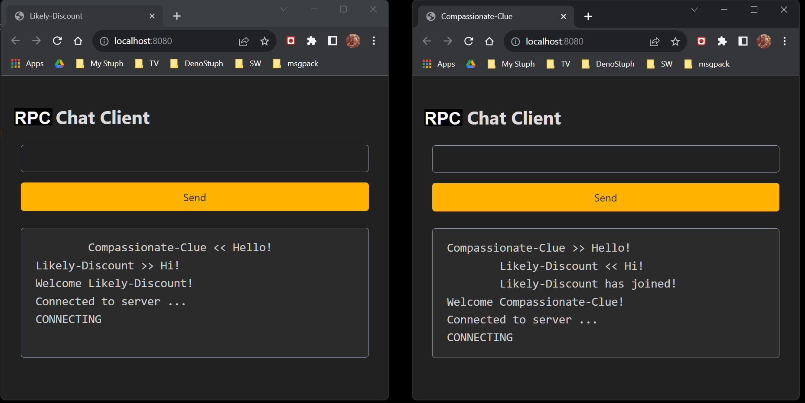
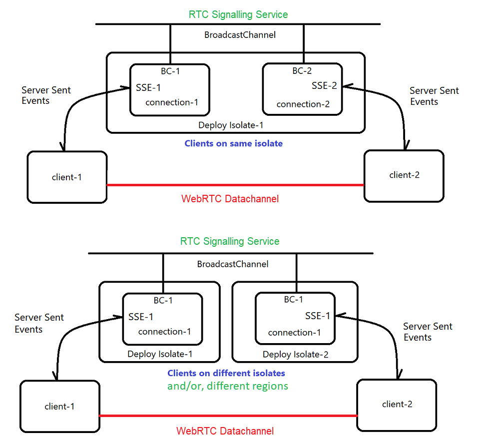

# Deno WebRTC Chat

## WIP -- Not yet complete!

## A super secure Chat-App 
This app leverages a Deno signalling service to signal/connect two RTC-Peers.    

This example uses Server Sent Events - SSE - rather than WebSockets for the signal service.   
Once connected, The two client peers have a direct secure channel to talk about anything    
that they would like to be kept private. 

There is no persistence involved! When a client closes, all traces are garbage collected by 
the sandboxed browser instance.     

Once connected by the signal service, there no further network activity    
other than the very private and secure P2P RTC-Datachannel.

## Try it now! https://rtc-chat.deno.dev/    -> Open two copies!
I like to open each side-by-side, in two separate browser windows.  

 

  

## Signalling service 
The Sinalling service is used to bridge two different isolates and/or regions.    
An example would be Peer-1 in California wants to connect with Peer-2 in Japan.    

Once signalling has completed, they will share a direct data-pipe with each other.    

 

  

 

## Note on security: 
Any data transmitted on an RTCDataChannel is automatically secured using     
Datagram Transport Layer Security (DTLS).    
More fundamentally, since WebRTC is a peer-to-peer connection between two user agents,    
the data never passes through the web or application server.    
This reduces opportunities to have the data intercepted.

 
