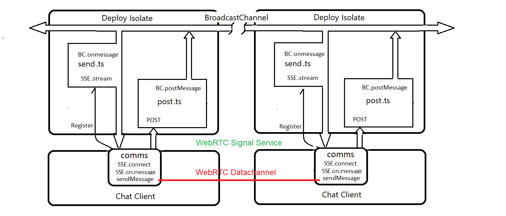
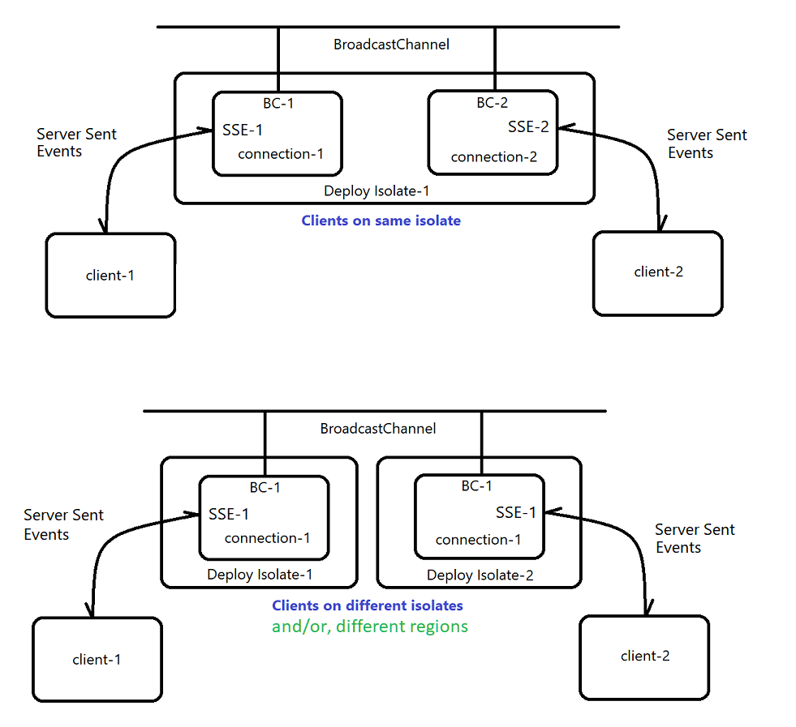
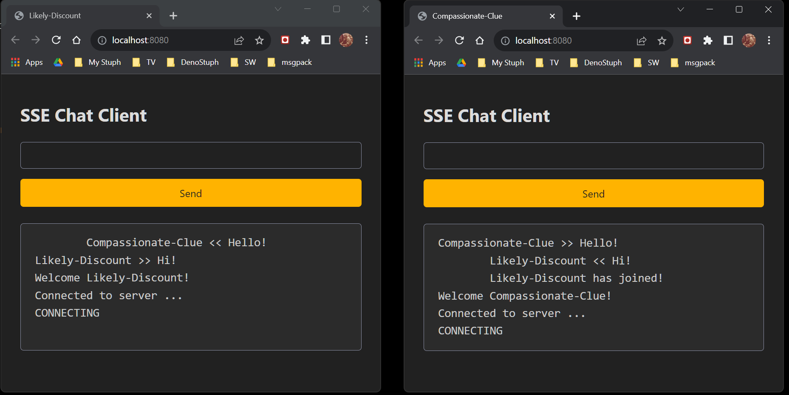

# Deno SSE-BC Chat
A super simple Chat-App that leverages Deno BroadcastChannel to bridge Deploy Isolates.   
This example uses Server Sent Events - SSE - rather than WebSockets for chat communications.   


 
    
To exercise the app, you'll need to open two copies. http://localhost:8080 

Bridging different isolates and/or regions.   

  


## To run a local copy, enter:
```
$ deno run --allow-net=0.0.0.0:8080 --allow-read=. --unstable server.ts
```

## Try it now! https://sse-chat.deno.dev/    -> Open two copies!


I like to open each side-by-side, in two separate browser windows.  

<br/>

  
